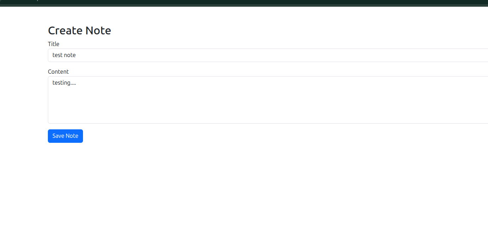
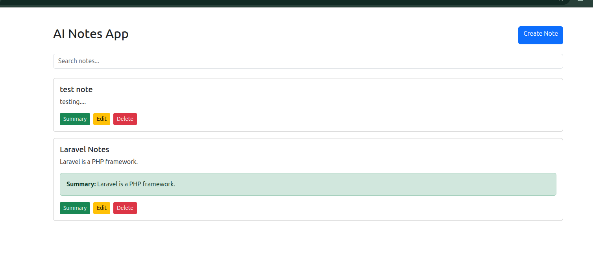
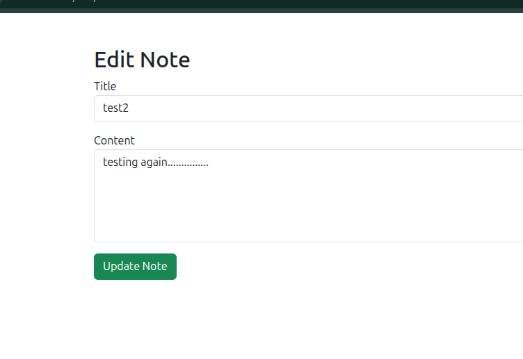
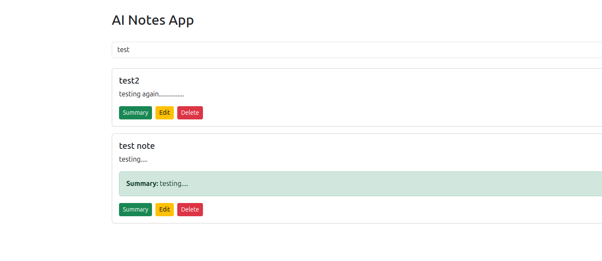
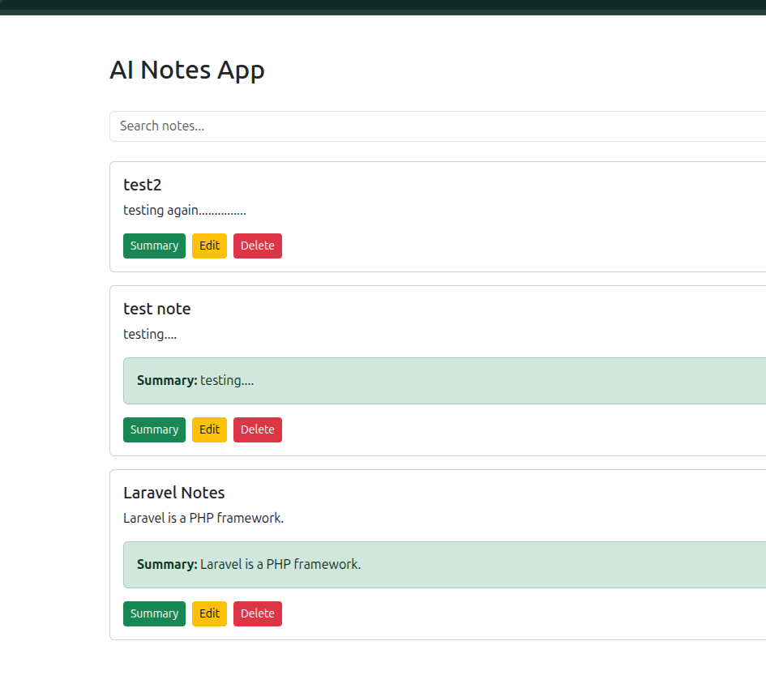

# Ai-notes-app
AI-powered Notes Management System built with Laravel, MySQL, REST APIs, search, pagination, and note summarization.
System allows users to create, edit, delete, search, and summarize notes through a simple web interface and REST APIs.

<p align="center"><a href="https://laravel.com" target="_blank"></a></p>

<p align="center">
<a href="https://github.com/laravel/framework/actions"></a>
<a href="https://packagist.org/packages/laravel/framework"></a>
<a href="https://packagist.org/packages/laravel/framework"></a>
<a href="https://packagist.org/packages/laravel/framework"></a>
</p>


## Features

- Create Notes
- View Notes
- Update Notes
- Delete Notes
- Search Notes
- Pagination
- Note Summary Generation
- REST APIs
- Laravel Blade Frontend













## Tech Stack

- Laravel
- PHP
- MySQL
- Bootstrap
- REST API

## Database Schema

### notes

| Column | Type |
|----------|----------|
| id | bigint |
| title | string |
| content | longText |
| summary | text |
| created_at | timestamp |
| updated_at | timestamp |

## API Endpoints

### Get Notes

GET /api/notes

### Create Note

POST /api/notes

### Get Single Note

GET /api/notes/{id}

### Update Note

PUT /api/notes/{id}

### Delete Note

DELETE /api/notes/{id}

### Search Notes

GET /api/notes/search?q=keyword

### Generate Summary

POST /api/notes/{id}/summary

## Setup Instructions

1. Clone Repository

```bash
git clone REPOSITORY_URL
```

2. Install Dependencies

```bash
composer install
```

3. Configure Environment

```bash
cp .env.example .env
```

Update database credentials.

4. Generate Key

```bash
php artisan key:generate
```

5. Run Migrations

```bash
php artisan migrate
```

6. Start Server

```bash
php artisan serve
```

## Architecture

Laravel Blade Frontend
↓
Laravel Controllers
↓
MySQL Database

## AI Usage

AI tools used during development:

- ChatGPT
- Gemini

Usage:

- Frontend scaffolding
- API design suggestions
- Debugging support
- Summary generation workflow design

Generated code was manually reviewed, tested, and modified before integration.

